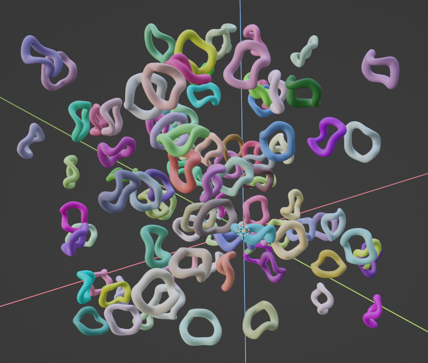

# blender_plots

Python API for plotting in blender 3.1.2

## Info

Blender can be a great tool for scientific visualization, but something as simple as making a plot with coordinates and
colors specified by numpy arrays still requires a lot of digging through the blender API.

The goal with this addon/library is to make the visualization process smoother by providing a matplotlib-like API for
making plots with blender. It currently supports scatterplots through `bplt.Scatter`.

## Getting started

* install the addon:
    * Option1: Go to `Code > Download ZIP` above and then in blender `Edit > Preferences > Add-ons > install` and select
      the downloaded file

    * Option2: Git-clone this repo to the blender addons folder.

* Go to the addons panel in blender, search for `blender plots` and click on the tick-box.
* You should now be able to run `import blender_plots as bplt` in the python console.

Since the built-in text editor isn't great I recommend using [jupyterlab](https://jupyter.org/)
with
a [blender kernel](https://blender.stackexchange.com/questions/172249/how-can-i-use-blenders-python-api-from-a-ipython-terminal-or-jupyter-notebook)
for advanced use-cases.

## Examples

### Plotting functions

For now all the plotting is done through `bplt.Scatter` which expects an `Nx3` numpy array of xyz coordinates and
optionally an `Nx3` or `Nx4` numpy array with RGB or RGBA color values.

```
import numpy as np
import blender_plots as bplt
n, l = 150, 100
x, y = np.meshgrid(np.linspace(0, l, n), np.linspace(0, l, n))

z = np.sin(2*np.pi * x / l)*np.sin(2*np.pi * y / l) * 20
scatter = bplt.Scatter(np.stack([x, y, z], axis=-1).reshape(-1, 3), color=(1, 0, 0), name="red")

z = np.sin(4*np.pi * x / l)*np.sin(4*np.pi * y / l) * 20 + 40
scatter = bplt.Scatter(np.stack([x, y, z], axis=-1).reshape(-1, 3), color=(0, 0, 1), name="blue")
```


### Visualizing point clouds

Since all heavy operations are done through numpy arrays or blender nodes it's possible to visualize large point clouds
with minimal overhead. For example, Here is one with 1M points from the user [Fovea](https://sketchfab.com/3dfovea) on
sketchfab:

```
import numpy as np
import blender_plots as bplt
points = np.loadtxt("/home/linus/Downloads/tikal-guatemala-point-cloud/source/fovea_tikal_guatemala_pcloud.asc")
scatter = bplt.Scatter(points[:, :3] - points[0, :3], color=points[:, 3:]/255, size=(0.3,0.3,0.3))
```


You can find the
model [here](https://sketchfab.com/3d-models/tikal-guatemala-point-cloud-ea0a4612234c4aa3bad3ad68dd369953)
(select `.asc` format).
License: [CC Attribution-NonCommercial-ShareAlikeCC](https://creativecommons.org/licenses/by-nc-sa/4.0/)

### Configuring the markers

The default marker shape is a cube but the API can be used to select and configure any mesh primitive, this is achieved
by automatically converting input arguments to geometry node properties.
See [blender_utils.py](https://github.com/Linusnie/blender_plots/blob/main/blender_utils.py)
for more details.

You can swap from the cube to any other mesh primitive shape by passing in `node_type=...`. In blender 3.1 the options
are
`GeometryNodeMeshCone`, `GeometryNodeMeshCube`, `GeometryNodeMeshCylinder`, `GeometryNodeMeshGrid`,
`GeometryNodeIcoSphere`, `GeometryNodeMeshCircle`, `GeometryNodeMeshLine` and `GeometryNodeUVSphere`.

For example from
the [cone node](https://docs.blender.org/manual/en/3.1/modeling/geometry_nodes/mesh_primitives/cone.html) docs we can
see that it has the parameters `Radius Top` and `Radius Bottom`, these can be configured by passing `radius_top=...`
and `radius_bottom=...` to `bplt.Scatter`:

```
scatter = bplt.Scatter(np.random.rand(n, 3)*50, color=np.random.rand(n, 3), node_type="GeometryNodeMeshCone", radius_bottom=1, radius_top=3, randomize_rotation=True)
```


I've also set `randomize_rotation=True` here to randomize the orientation of each marker.

Similarly, the [cube node](https://docs.blender.org/manual/en/latest/modeling/geometry_nodes/mesh_primitives/cube.html)
has a vector-valued `Size` parameter:

```
bplt.Scatter(np.random.rand(n, 3)*50, color=np.random.rand(n, 3), size=(5, 1, 1), randomize_rotation=True)
```


### Custom mesh as marker

You can also use an existing mesh by passing it to `point_type=...`:

```
bplt.Scatter(np.random.rand(n, 3)*50, color=np.random.rand(n, 3), point_type=bpy.context.scene.objects["twisted_torus"], randomize_rotation=True)
```



### Perfect sphere markers

You can get perfect spheres as markers by passing in `point_type="spheres"`. Though note that these are only visible in
the rendered view and with the rendering engine set to cycles

```
bplt.Scatter(np.random.rand(n, 3)*50, color=np.random.rand(n, 3), point_type="spheres", radius=1.5)
```


