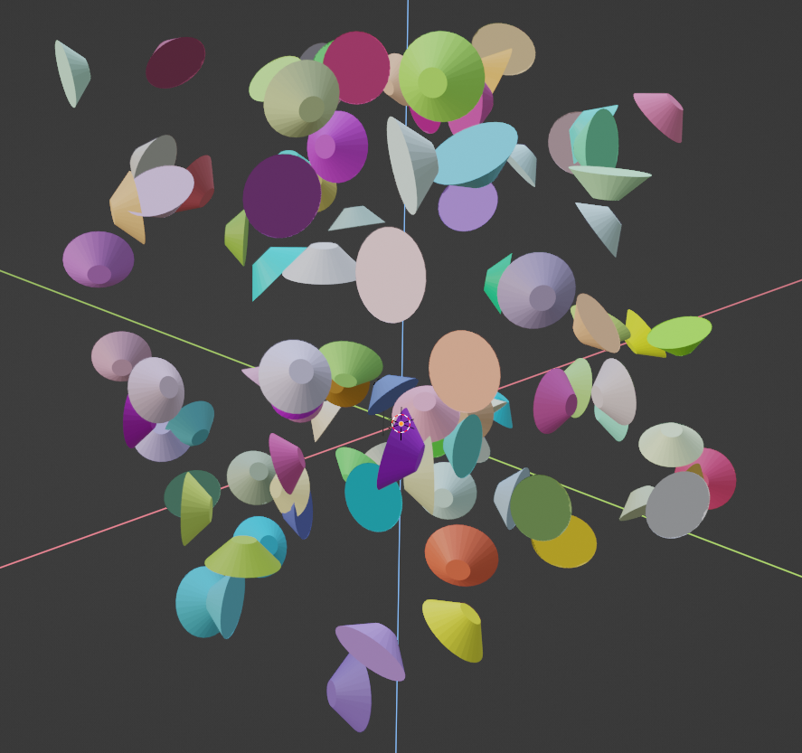

# blender_plots
Python API for plotting in blender

## Info

Blender can be a great tool for scientific visualization, but something as simple as making a plot
with coordinates and colors specified by numpy arrays still requires a lot of digging through the blender API.

The goal with this addon/library is to make the visualization process smoother by providing a matplotlib-like API
for making plots with blender. It currently supports scatterplots through `bplt.Scatter`.

## Examples
Also see examples.ipynb

### Function plotting
```
import blender_plots as bplt

n = 150
l = 100
x, y = np.meshgrid(np.linspace(0, l, n), np.linspace(0, l, n))

z = np.sin(2*np.pi * x / l)*np.sin(2*np.pi * y / l) * 20
scatter = bplt.Scatter(np.stack([x, y, z], axis=-1).reshape(-1, 3), color=(1, 0, 0), name="red")

z = np.sin(4*np.pi * x / l)*np.sin(4*np.pi * y / l) * 20 + 40
scatter = bplt.Scatter(np.stack([x, y, z], axis=-1).reshape(-1, 3), color=(0, 0, 1), name="blue")
```


### Configuring the markers
The API automatically converts input arguments to geometry node properties for generating the point instances.
See blender_utils.py for more details.

The default shape is a cube and we can see in the docs that it has a `Size` parameter.
We can modifiy this parameter by passing `size=...` to `bplt.Scatter`:
```
scatter = bplt.Scatter(np.random.rand(n, 3)*50, color=np.random.rand(n, 3), size=(5, 1, 1), randomize_rotation=True)
```


You can swap from the cube to any other mesh primitive by passing in `node_type=...`. 
In blender 3.1 the options are 
`GeometryNodeMeshCone`, `GeometryNodeMeshCube`, `GeometryNodeMeshCylinder`, `GeometryNodeMeshGrid`, 
`GeometryNodeIcoSphere`, `GeometryNodeMeshCircle`, `GeometryNodeMeshLine`, `GeometryNodeUVSphere`.

For example:
```
scatter = bplt.Scatter(np.random.rand(n, 3)*50, color=np.random.rand(n, 3), node_type="GeometryNodeMeshCone", radius_bottom=1, radius_top=3, randomize_rotation=True)
```


### Custom mesh as marker
You can also use an existing mesh by passing it using `point_type=...`. For example:
```
scatter = bplt.Scatter(np.random.rand(n, 3)*50, color=np.random.rand(n, 3), point_type=bpy.context.scene.objects["twisted_torus"], randomize_rotation=True)
```

