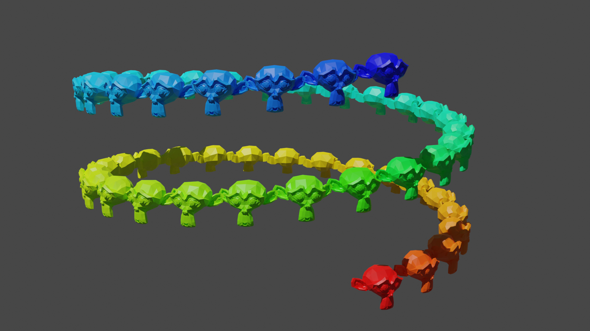

# blender-plots

Python API for plotting in blender >=3.2

## Info

Blender can be a great tool for scientific visualization, but something as simple as making a plot with coordinates and
colors specified by numpy arrays still requires a lot of digging through the API.

The goal with this addon/library is to make the visualization process smoother by providing a matplotlib-like API for
making plots. It currently supports scatterplots through `bplt.Scatter`.


## Getting started

* Install the addon:
    * Option1: Go to `Code > Download ZIP` above and then in blender go to `Edit > Preferences > Add-ons > install` and
      select the downloaded file.
    * Option2: Git-clone this repo to the blender addons folder.
* Go to the addons panel in blender, search for `blender plots` and click on the tick-box.
* You should now be able to run `import blender_plots as bplt` in the python console.

Since the built-in text editor isn't great I recommend using [jupyterlab](https://jupyter.org/)
with
a [blender kernel](https://github.com/cheng-chi/blender_notebook)
for advanced use-cases.

## Examples

### Plotting functions

For now all the plotting is done through `bplt.Scatter` which expects three arrays x, y, z with the same length `N`
containing coordinates to plot (or equivalently a single `Nx3` array as the first argument). Color can also be set using
the `color=` argument, which expects a`Nx3` or `Nx4` numpy array with RGB or RGBA color values. Passing in a single RGB
or RGBA value sets the same color for all points.

```
import numpy as np
import blender_plots as bplt
n, l = 150, 100
x, y = np.meshgrid(np.linspace(0, l, n), np.linspace(0, l, n))
x, y = x.ravel(), y.ravel()

z = np.sin(2*np.pi * x / l)*np.sin(2*np.pi * y / l) * 20
bplt.Scatter(x, y, z, color=(1, 0, 0), name="red")

z = np.sin(4*np.pi * x / l)*np.sin(4*np.pi * y / l) * 20 + 40
bplt.Scatter(x, y, z, color=(0, 0, 1), name="blue")
```


### Animations

To get an animated plot, just pass in x, y, z as `TxN` arrays instead (or `TxNx3` as the first argument):

```
# plot animated function
n, l, T = 150, 100, 100
t, x, y = np.meshgrid(np.arange(0, T), np.linspace(0, l, n), np.linspace(0, l, n), indexing='ij')
t, x, y = t.reshape((T, -1)), x.reshape((T, -1)), y.reshape((T, -1))

z = np.sin(2*np.pi * x / l) * np.sin(2*np.pi * y / l) * np.sin(2*np.pi * t / T) * 20
bplt.Scatter(x, y, z, color=(1, 0, 0), name="red")

z = np.sin(4*np.pi * x / l) * np.sin(4*np.pi * y / l) * np.sin(8*np.pi * t / T) * 20 + 40
bplt.Scatter(x, y, z, color=(0, 0, 1), name="blue")
```

https://user-images.githubusercontent.com/12471058/175827154-f2788971-78d3-4778-937a-5d0ff30af7fd.mp4

### Visualizing point clouds

Since all heavy operations are done through numpy arrays or blender nodes it's possible to visualize large point clouds
with minimal overhead. For example, Here is one with 1M points:

```
import numpy as np
import blender_plots as bplt
points = np.loadtxt("/home/linus/Downloads/tikal-guatemala-point-cloud/source/fovea_tikal_guatemala_pcloud.asc")
scatter = bplt.Scatter(points[:, :3] - points[0, :3], color=points[:, 3:]/255, size=(0.3,0.3,0.3))
```


You can find the
model [here](https://sketchfab.com/3d-models/tikal-guatemala-point-cloud-ea0a4612234c4aa3bad3ad68dd369953)
(select `.asc` format). Original source: [OpenHeritage](https://openheritage3d.org/project.php?id=708h-ss96),
license: [CC Attribution-NonCommercial-ShareAlikeCC](https://creativecommons.org/licenses/by-nc-sa/4.0/).

### Marker options

You can swap from the cube to any other mesh primitive using the `marker_type` argument. In blender 3.1 the options are
[cones](https://docs.blender.org/manual/en/3.1/modeling/geometry_nodes/mesh_primitives/cone.html),
[cubes](https://docs.blender.org/manual/en/3.1/modeling/geometry_nodes/mesh_primitives/cube.html),
[cylinders](https://docs.blender.org/manual/en/3.1/modeling/geometry_nodes/mesh_primitives/cylinder.html),
[grids](https://docs.blender.org/manual/en/3.1/modeling/geometry_nodes/mesh_primitives/grid.html),
[ico_spheres](https://docs.blender.org/manual/en/3.1/modeling/geometry_nodes/mesh_primitives/icosphere.html),
[circles](https://docs.blender.org/manual/en/3.1/modeling/geometry_nodes/mesh_primitives/mesh_circle.html),
[lines](https://docs.blender.org/manual/en/3.1/modeling/geometry_nodes/mesh_primitives/mesh_line.html) or
[uv_spheres](https://docs.blender.org/manual/en/3.1/modeling/geometry_nodes/mesh_primitives/uv_sphere.html).


Each marker type can further be configured by passing in node settings as parameter arguments. For example from
the [cone node](https://docs.blender.org/manual/en/3.1/modeling/geometry_nodes/mesh_primitives/cone.html)
docs we can see that it has the parameters `Radius Top` and `Radius Bottom`, these can be set directly by
passing `radius_top=...`
and `radius_bottom=...` to `bplt.Scatter`:

```
scatter = bplt.Scatter(
    np.random.rand(n, 3)*50,
    color=np.random.rand(n, 3),
    marker_type="cones",
    radius_bottom=1,
    radius_top=3,
    randomize_rotation=True
)
```


Similarly, the [cube node](https://docs.blender.org/manual/en/latest/modeling/geometry_nodes/mesh_primitives/cube.html)
has a vector-valued `Size` parameter:

```
bplt.Scatter(
    np.random.rand(n, 3)*50,
    color=np.random.rand(n, 3),
    size=(5, 1, 1),
    randomize_rotation=True
)
```


This is achieved by automatically converting input arguments to geometry node properties.
See [blender_utils.py](https://github.com/Linusnie/blender_plots/blob/main/blender_utils.py)
for more details.

### Rotating markers
Each marker can be assigned a rotation using the argument `marker_rotation=...`, similarly to the color argument it
supports passing a single value for all points, one for each point, or one for each point and timestamp.
The supported formats are XYZ euler angles in radians (by passing an Nx3 or NxTx3 array) or rotation matrices
(by passing a Nx3x3 or NxTx3x3 array). As shown in the previous examples passing `randomize_rotation=True` assigns a
random rotation to each marker.

```
def get_rotaitons_facing_point(origin, points):
    n_points = len(points)
    d = (origin - points) / np.linalg.norm(origin - points, axis=-1)[:, None]
    R = np.zeros((n_points, 3, 3))
    R[..., -1] = d
    R[..., 0] = np.cross(d, np.random.randn(n_points, 3))
    R[..., 0] /= np.linalg.norm(R[..., 0], axis=-1)[..., None]
    R[..., 1] = np.cross(R[..., 2], R[..., 0])
    return R

n = 5000
points = np.random.randn(n, 3) * 20
rots = get_rotaitons_facing_point(np.zeros(3), points)
s = bplt.Scatter(
    points,
    marker_rotation=rots,
    color=np.array([[1.0, 0.1094, 0.0], [0.0, 0.1301, 1.0]])[np.random.randint(2, size=n)],
    size=(1, 1, 5),
)
```


### Custom mesh as marker

You can also use an existing mesh by passing it to `marker_type=...`:

```
from colorsys import hls_to_rgb
bpy.ops.mesh.primitive_monkey_add()
monkey = bpy.context.active_object
monkey.hide_viewport = True
monkey.hide_render = True
n = int(.5e2)

scatter = bplt.Scatter(
    50 * np.cos(np.linspace(0, 1, n)*np.pi*4),
    50 * np.sin(np.linspace(0, 1, n)*np.pi*4),
    50 * np.linspace(0, 1, n),
    color=np.array([hls_to_rgb(2/3 * i/(n-1), 0.5, 1) for i in range(n)]),
    marker_type=monkey,
    radius_bottom=1,
    radius_top=3,
    marker_scale=[5]*3,
    marker_rotation=np.array([np.zeros(n), np.zeros(n), np.pi/2 + np.linspace(0, 4 * np.pi, n)]).T,
)
```



### Sphere markers

You can get perfect spheres as markers by passing in `marker_type="spheres"`. Though note that these are only visible in
the rendered view and with the rendering engine set to cycles

```
bplt.Scatter(
    np.random.rand(n, 3)*50,
    color=np.random.rand(n, 3),
    marker_type="spheres",
    radius=1.5
)
```


